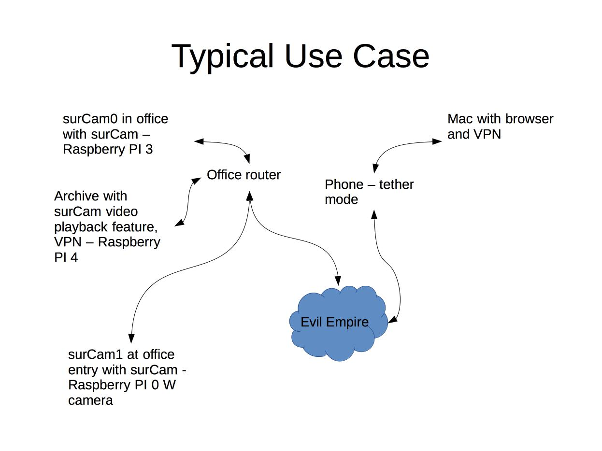

# surCam

This repository contains code that implements a surveillance camera using a Raspberry PI (PI 0 W, PI 3, or PI 4), the python module picamera, and a PI camera.  I have several of these monitoring my home.  When I'm away from home, if I get an email that motion has been detected by one of my cameras, I can login to my home network and see the captured and live video.

surCam motion detection triggers 15 seconds of video to be captured.  This video is stored on camera and at a remote location.  Motion detection can be tailored to the scene being monitored.  The area of interest (a mask superimposed on the image) and a sensitivity can be set. 

One of my cameras is shown below.


The design assumes a use case as illustrated below.



  1) Cameras are distributed at a location.
  2) Each camera is tailored for the scene it is monitoring.
  3) The cameras monitor the scene
     - When motion is detected, video is captured and notification email is sent
     - When video collection is complete, a copy is sent to a central archive
  4) When the remote user receives a notification
     - User logs into the monitored location LAN via VPN
     - User uses a standard browser to view the captured video or live video

## Installation of camera control software (assuming a Debian/Raspbian buster or better Linux distribution)

  1)  sudo apt-get update
  2)  sudo apt-get upgrade
  3)  sudo apt-get install git python3-pip python3-numpy
  4)  sudo pip3 install picamera
  5)  git clone https://github.com/mbroihier/surcam
      - cd surcam
      - from raspi-config, enable camera if you have not done that before
      - if running on a PI 0, add force_turbo=1 and over_voltage=4 (note warnings about this) to /boot/config.txt file and reboot
      - python3 surveillance_camera.py
  6)  Using a browser, connect to
      - http://\<your pi IP address\>:8000
  7)  If you want to make surCam a service
      - edit any necessary paths in surCam.service and surCamWrapper files
      - sudo cp -p surCam.service /lib/systemd/system/
      - sudo systemctl enable surCam
      - sudo systemctl start surCam

If you want to tailor the areas of the scene that are sensitive to motion detection, use

```
python3 calibrateSurCam.py
```

If you want to view video only, use
```
python3 playback.py (useful at achive location)
```

## Setting up remote archive and email notification.

The previous instructions apply to only the camera control/administration software.  Notifications are performed by a program called "whatsnew" that is in the https://github.com/mbroihier/whatsnew repository.  This software performs a monitoring task and sends an email to a configured email account.  One of the tasks that whatsnew can do is monitor a directory.  When the directory changes, change information is sent to an email address and the new files in the directory are copied to another location.  The copy is performed using scp and shared ssh keys with a remote machine.  So the destination needs ssh/scp capability - another PI running Raspbian is a good choice especially since rm and find are also used.

  1) Pick an archive site - this location needs ssh/scp support and plenty of disk space to store your video files.
  2) At this site, create a user account named surcam.
  3) Setup a directory /blks/surCam that belongs to the surcam user (the destination will be configurable in future releases)
  4) Share your ssh keys between your cameras and the archive site using the same usr accounts as will be used with the camera software.
  5) Make sure that you can login to the archive from each camera site without entering a password.
  6) At each camera site, install whatsnew and configure it to monitor the directory where surCam is installed.
